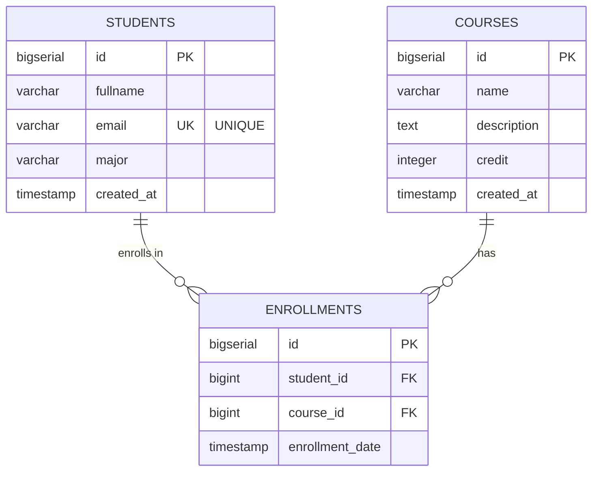
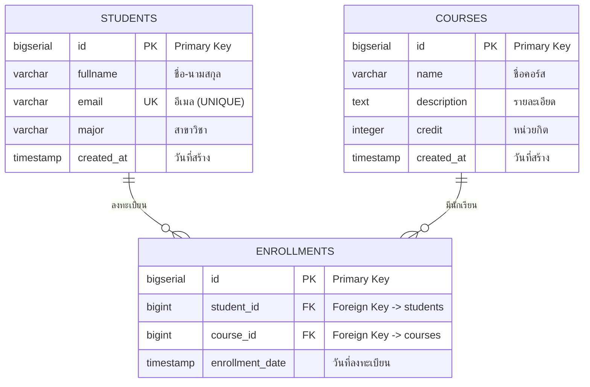
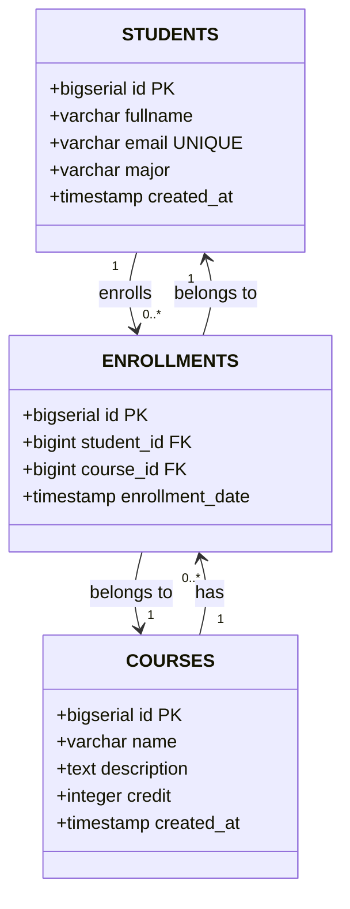

# ERD (Entity Relationship Diagram) - Mermaid Code

## วิธีใช้งาน:
1. คัดลอกโค้ด Mermaid ด้านล่าง
2. ไปที่ https://mermaid.live/ หรือ https://app.diagrams.net/
3. Paste โค้ดและ Export เป็น PNG

---

## Mermaid Code - ERD

---

## Mermaid Code - ERD (รูปแบบที่ 2 - แสดง Cardinality ชัดเจน)

---

## อธิบายสัญลักษณ์:

- `||--o{` = One-to-Many (1 student มีหลาย enrollments)
- `PK` = Primary Key
- `FK` = Foreign Key
- `UK` = Unique Key

---

## ความสัมพันธ์:

1. **STUDENTS ↔ ENROLLMENTS**: One-to-Many
   - 1 นักเรียนสามารถลงทะเบียนได้หลายคอร์ส

2. **COURSES ↔ ENROLLMENTS**: One-to-Many
   - 1 คอร์สสามารถมีนักเรียนหลายคนลงทะเบียน

3. **STUDENTS ↔ COURSES**: Many-to-Many (ผ่าน ENROLLMENTS)
   - นักเรียนหลายคนสามารถลงทะเบียนได้หลายคอร์ส

---

## Alternative: Class Diagram Style

---

## สำหรับ Draw.io:

1. เปิด https://app.diagrams.net/
2. File > Import from > URL
3. หรือใช้ Extensions > Plugins > Mermaid (ถ้ามี)
4. หรือสร้างด้วยมือจาก Shape Library

### ขั้นตอนสร้างด้วยมือใน Draw.io:

1. เลือก Entity (สี่เหลี่ยม) 3 อัน สำหรับ STUDENTS, COURSES, ENROLLMENTS
2. เขียน attributes ในแต่ละ entity:
   - **STUDENTS**: id (PK), fullname, email, major, created_at
   - **COURSES**: id (PK), name, description, credit, created_at
   - **ENROLLMENTS**: id (PK), student_id (FK), course_id (FK), enrollment_date
3. ลากเส้นเชื่อม:
   - STUDENTS → ENROLLMENTS (1:M)
   - COURSES → ENROLLMENTS (1:M)
4. ใส่ label บนเส้น: "1" และ "M" หรือ "*"
5. Export เป็น PNG
