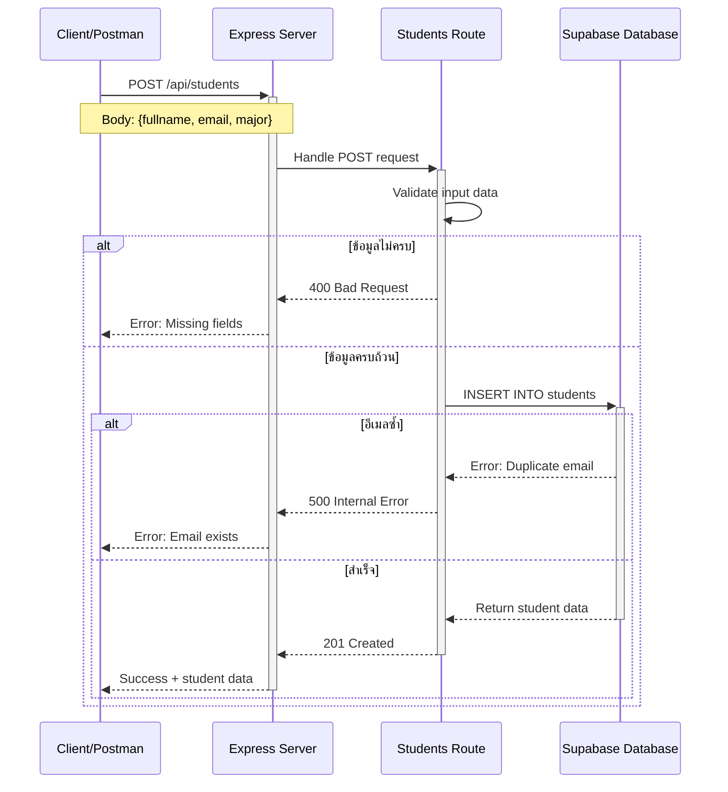
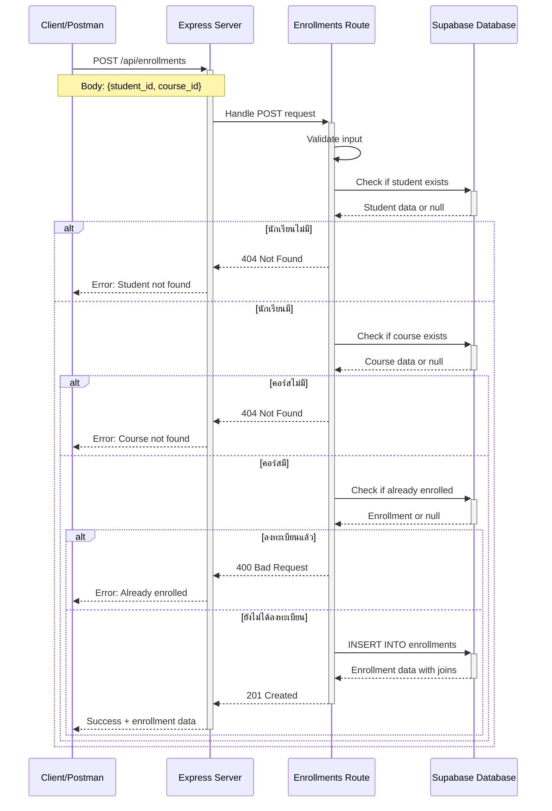
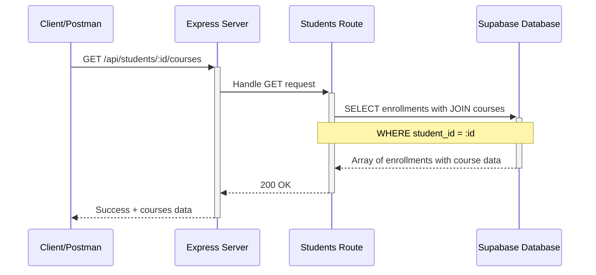
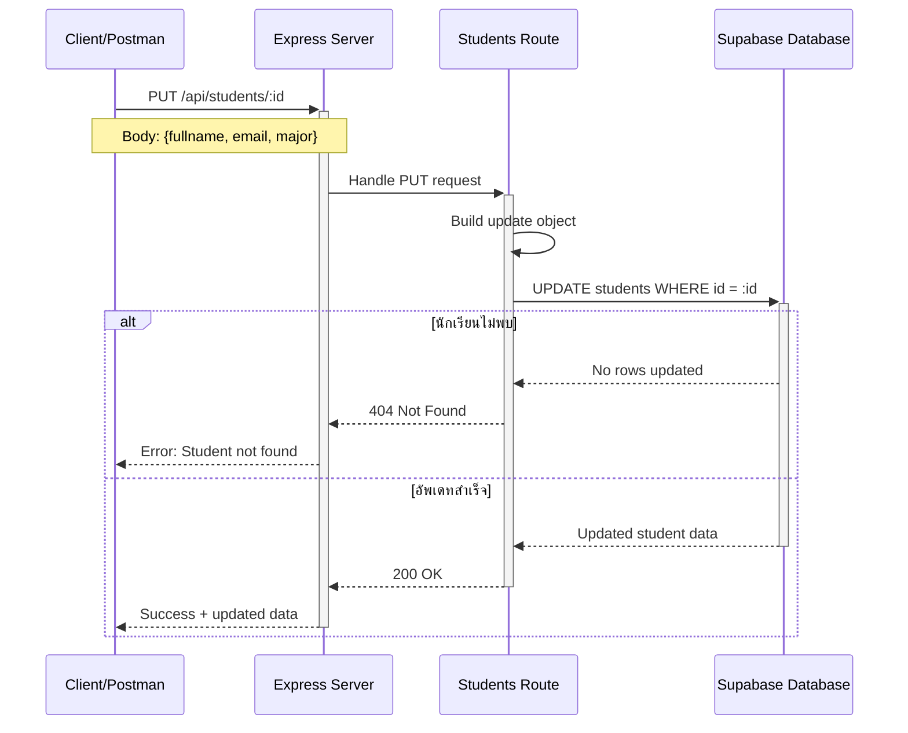
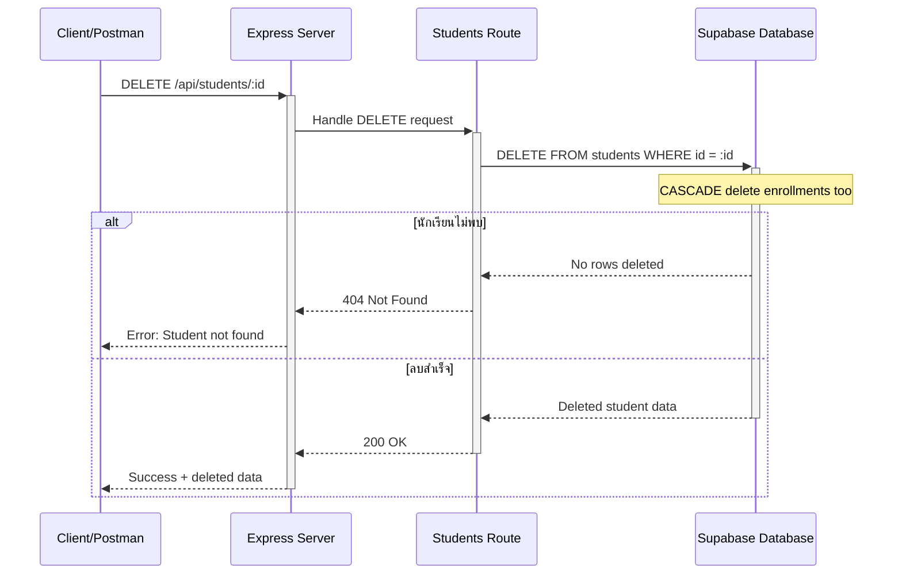
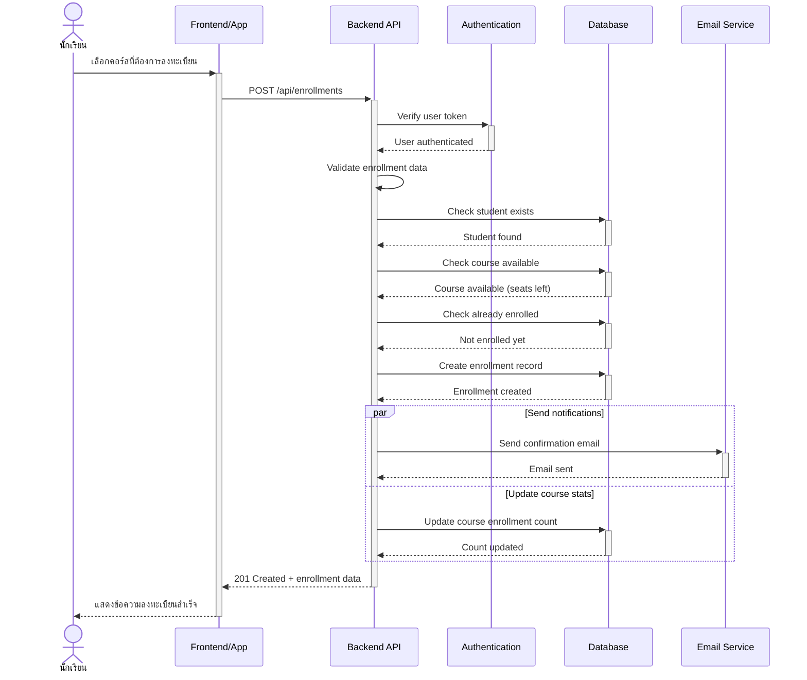
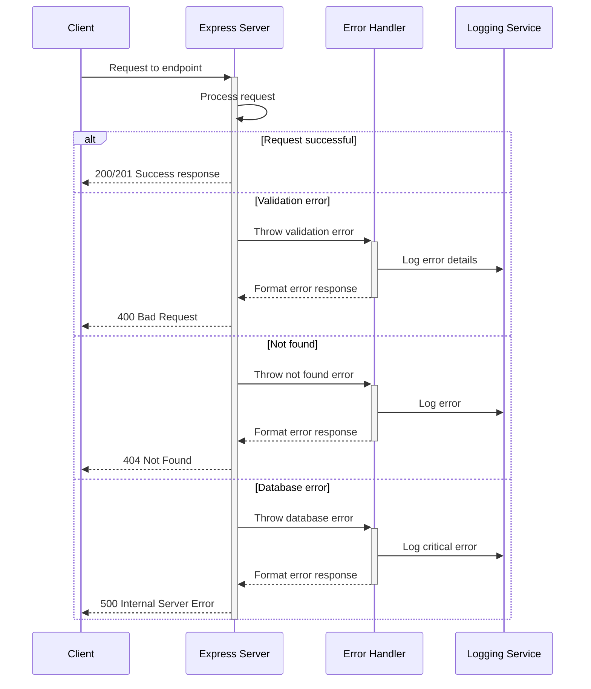
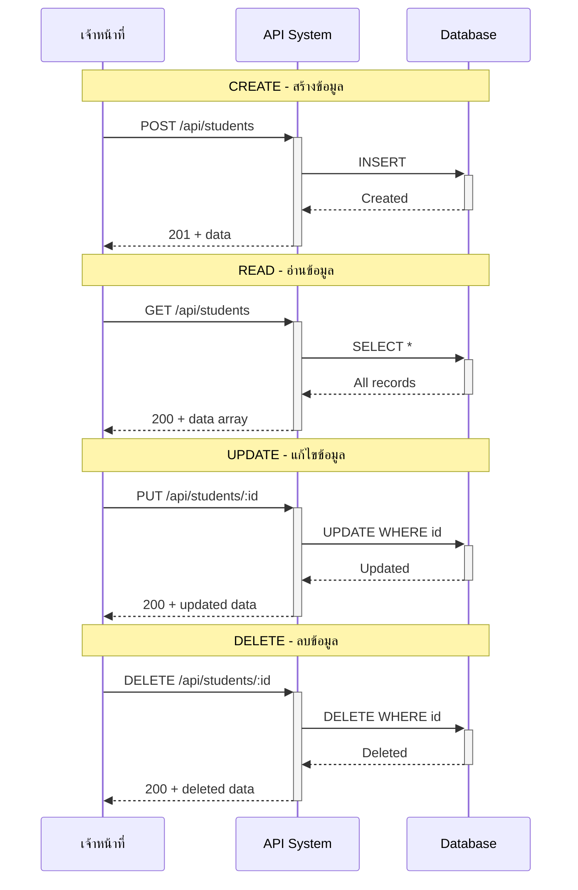

# Sequence Diagram - Mermaid Code
## (เพิ่มเติม - แสดงการทำงานของ API)

## วิธีใช้งาน:
1. คัดลอกโค้ด Mermaid ด้านล่าง
2. ไปที่ https://mermaid.live/
3. Paste โค้ดและ Export เป็น PNG

---

## 1. Sequence Diagram - สร้างนักเรียน (Create Student)

---

## 2. Sequence Diagram - ลงทะเบียนเรียน (Create Enrollment)

---

## 3. Sequence Diagram - ดึงคอร์สของนักเรียน (Get Student's Courses)

---

## 4. Sequence Diagram - แก้ไขนักเรียน (Update Student)

---

## 5. Sequence Diagram - ลบนักเรียน (Delete Student)

---

## 6. Sequence Diagram - Complete Enrollment Flow

---

## 7. Sequence Diagram - API Error Handling Flow

---

## 8. Sequence Diagram - Full CRUD Workflow

---

## การใช้งาน Sequence Diagrams:

1. **สำหรับเอกสาร** - แสดงให้เห็น flow การทำงานของระบบ
2. **สำหรับทีม** - ช่วยให้เข้าใจการทำงานร่วมกัน
3. **สำหรับ Debug** - ติดตาม flow หาจุดที่เกิด error
4. **สำหรับนำเสนอ** - อธิบายการทำงานให้ผู้อื่นเข้าใจ

---

## Export เป็นภาพ:

1. ไปที่ https://mermaid.live/
2. Paste โค้ด Mermaid
3. คลิก "Actions" > "PNG" หรือ "SVG"
4. บันทึกเป็น `SequenceDiagram_CreateStudent.png` ฯลฯ
