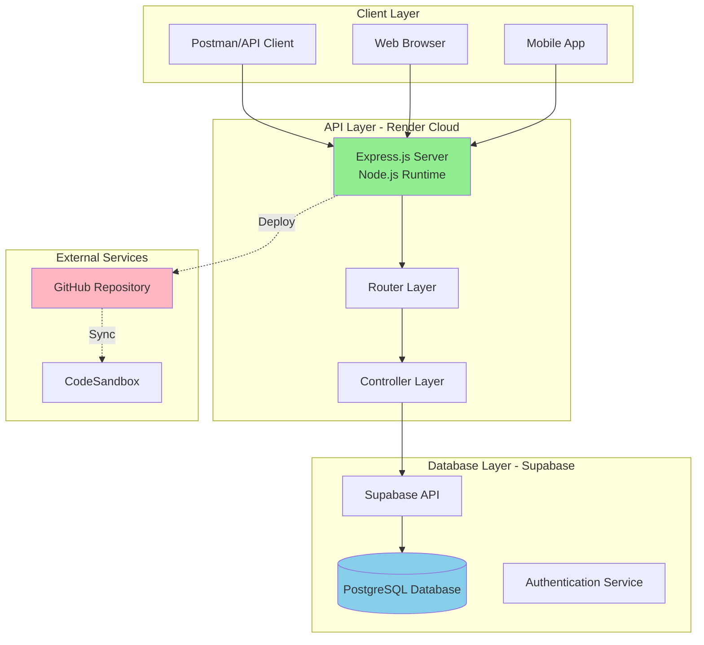
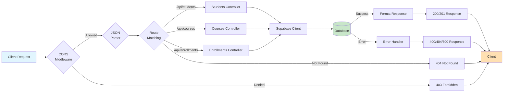
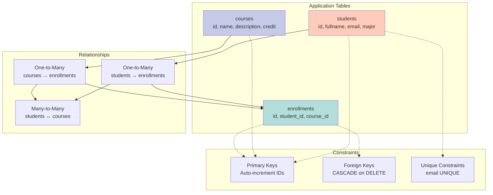
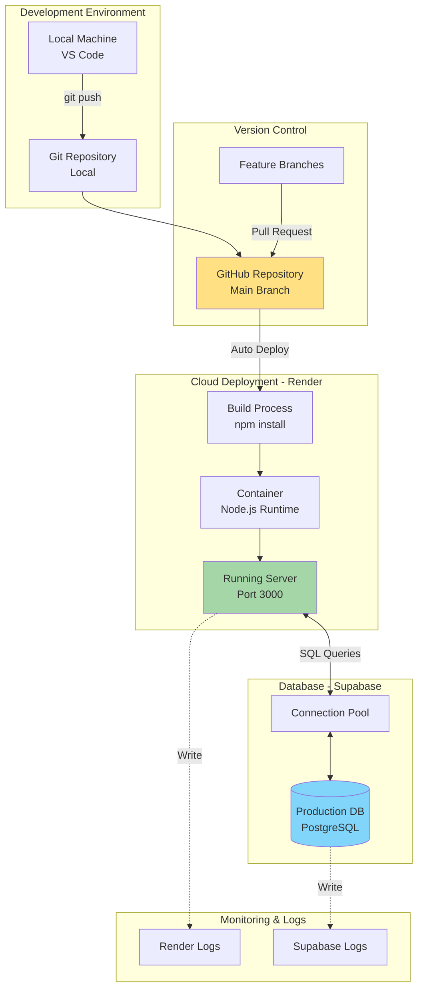
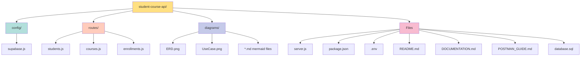
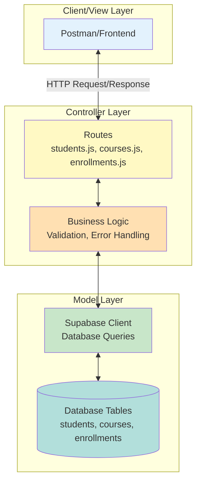
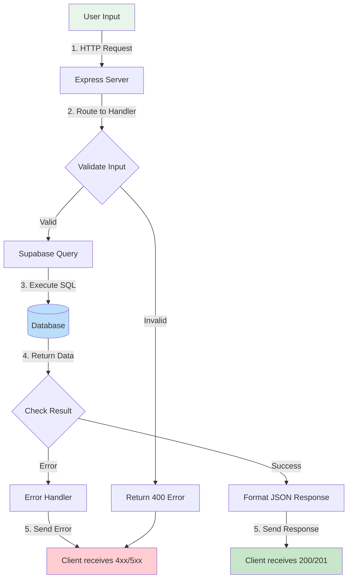
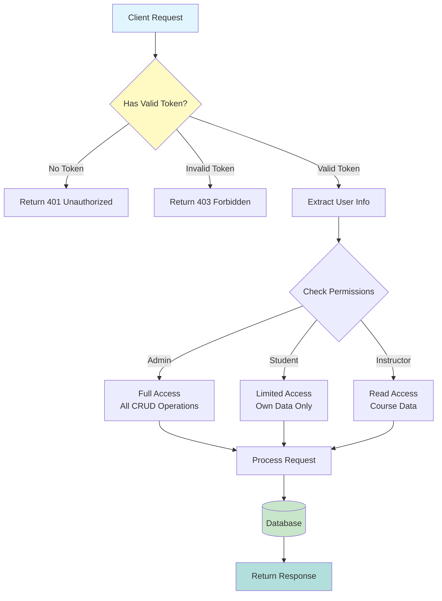
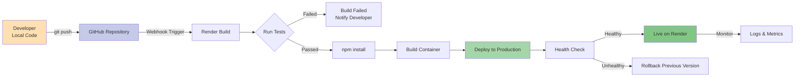

# System Architecture Diagram - Mermaid Code

## วิธีใช้งาน:
1. คัดลอกโค้ด Mermaid ด้านล่าง
2. ไปที่ https://mermaid.live/
3. Paste โค้ดและ Export เป็น PNG

---

## 1. System Architecture Overview



---

## 2. API Request Flow Architecture



---

## 3. Database Schema Architecture



---

## 4. Deployment Architecture



---

## 5. RESTful API Architecture

```mermaid
graph LR
    A[HTTP Methods] --> B[GET<br/>Read]
    A --> C[POST<br/>Create]
    A --> D[PUT<br/>Update]
    A --> E[DELETE<br/>Remove]
    
    B --> F[/api/students<br/>/api/courses<br/>/api/enrollments]
    C --> F
    D --> F
    E --> F
    
    F --> G{Route Handler}
    
    G --> H[Query Database]
    H --> I{Response}
    
    I -->|Success| J[200 OK<br/>201 Created]
    I -->|Not Found| K[404 Not Found]
    I -->|Bad Request| L[400 Bad Request]
    I -->|Server Error| M[500 Internal Error]
    
    style A fill:#E1BEE7
    style F fill:#FFCCBC
    style I fill:#B2DFDB
```

---

## 6. Project Structure Diagram



---

## 7. MVC Pattern Architecture (Simplified)



---

## 8. Data Flow Diagram



---

## 9. Security & Authentication Architecture (Future Enhancement)



---

## 10. CI/CD Pipeline Architecture



---

## สรุป Architecture Components:

### 1. **Frontend Layer**
- Postman (API Testing)
- Web/Mobile Apps (Future)

### 2. **Backend Layer**
- Express.js Server
- RESTful API Routes
- Business Logic

### 3. **Database Layer**
- Supabase (PostgreSQL)
- Connection Pool
- Query Optimization

### 4. **Deployment**
- GitHub (Version Control)
- Render (Cloud Hosting)
- Environment Variables

### 5. **Monitoring**
- Server Logs
- Database Logs
- Error Tracking

---

## Export Instructions:

1. เข้า https://mermaid.live/
2. Paste โค้ดที่ต้องการ
3. คลิก "Actions" > "Export as PNG/SVG"
4. บันทึกไฟล์ตามชื่อ diagram
5. ใส่ใน folder `diagrams/`

---

**หมายเหตุ:** Architecture diagrams เหล่านี้จะช่วยให้เข้าใจภาพรวมของระบบได้ดีขึ้น เหมาะสำหรับการนำเสนอหรือเอกสารประกอบ
