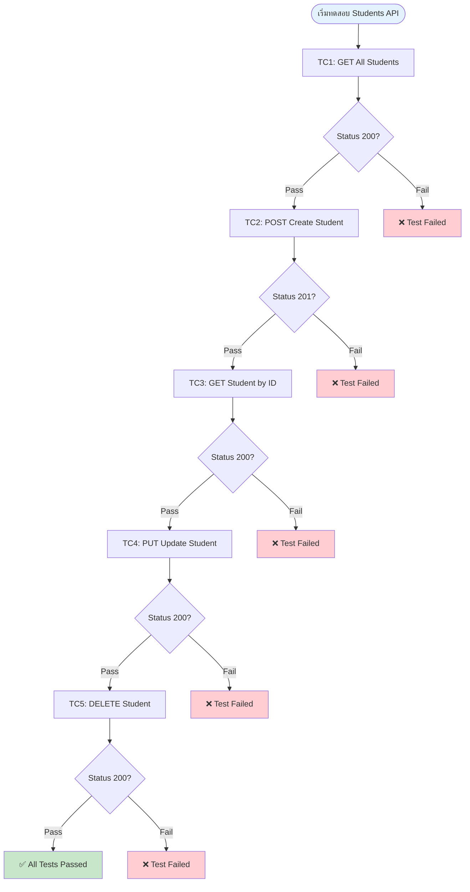
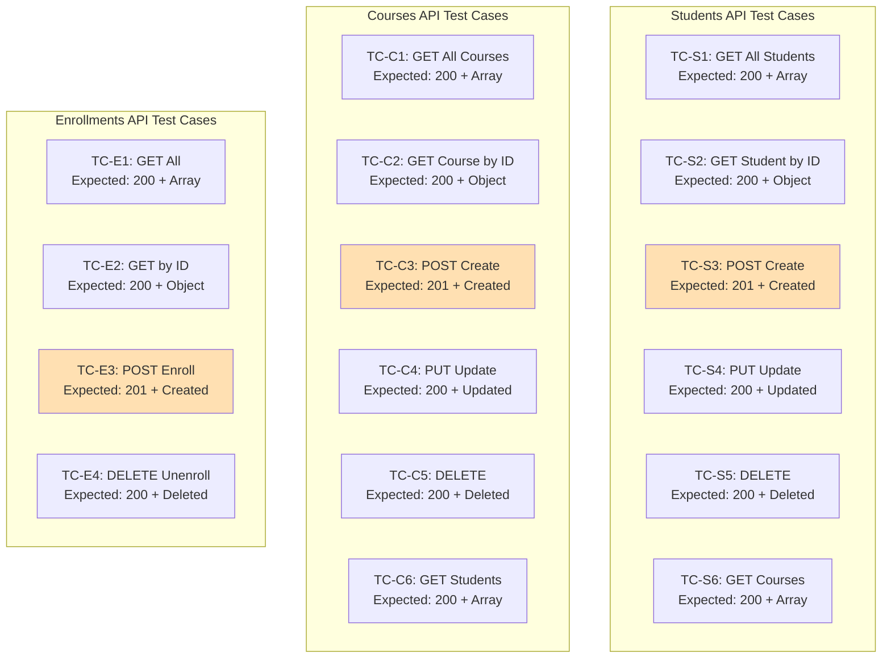
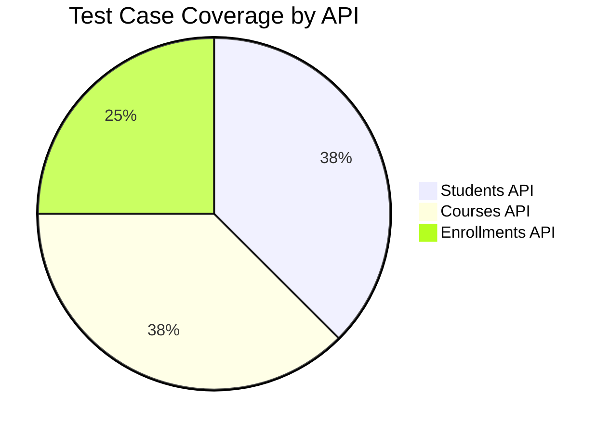
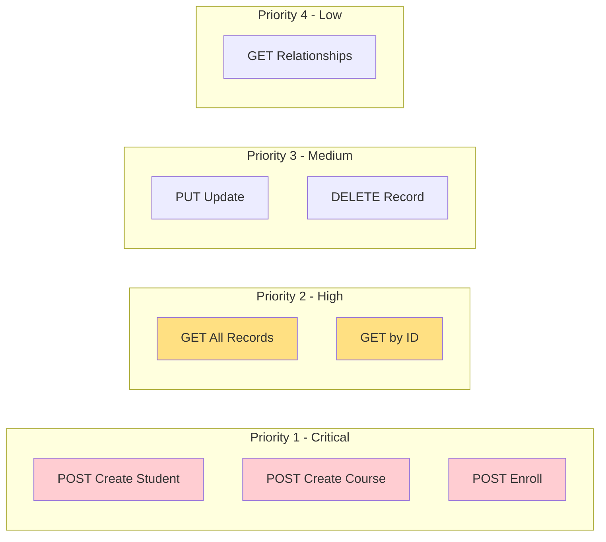
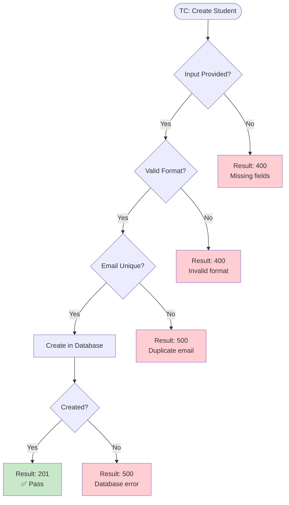
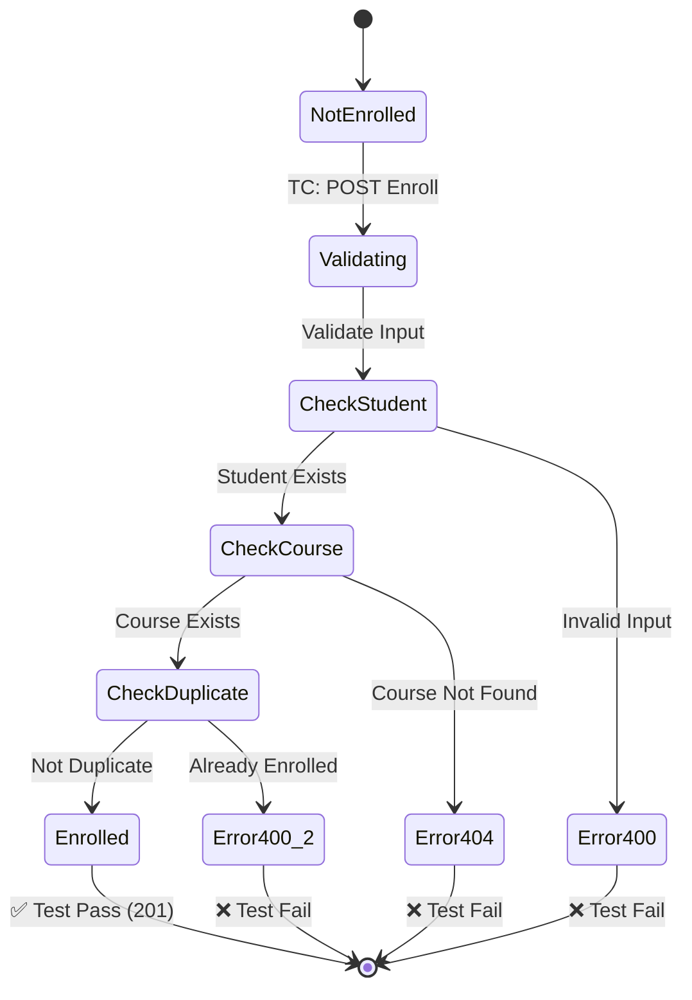
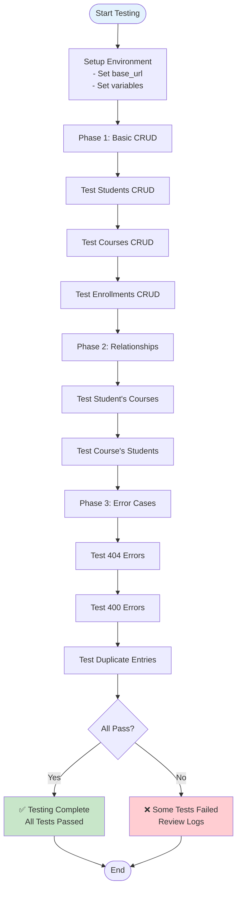
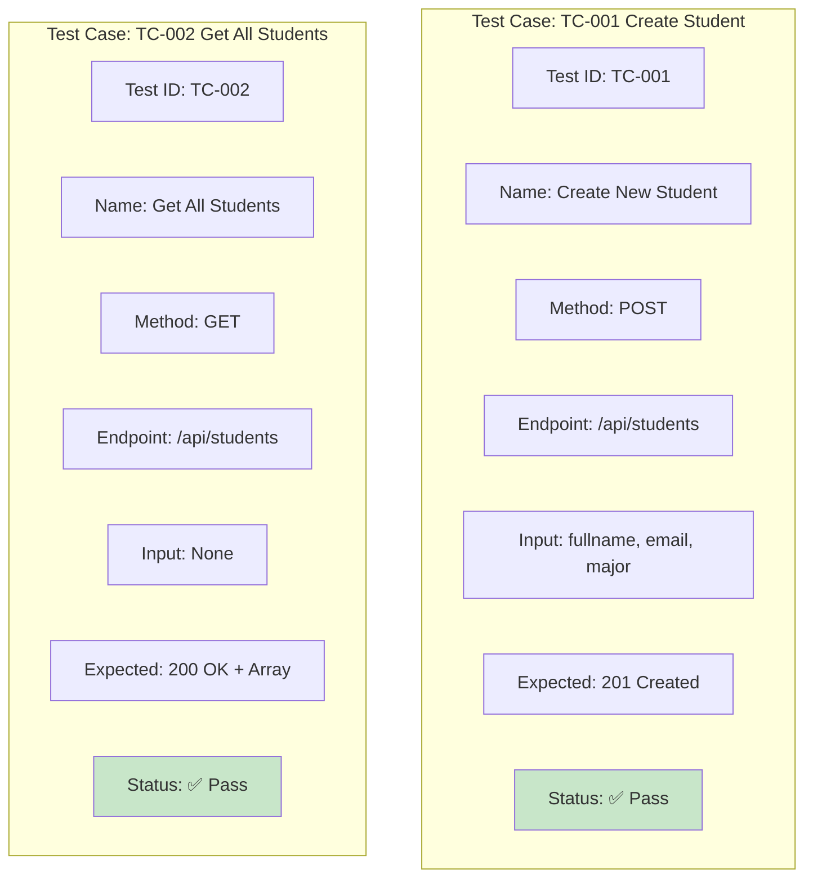
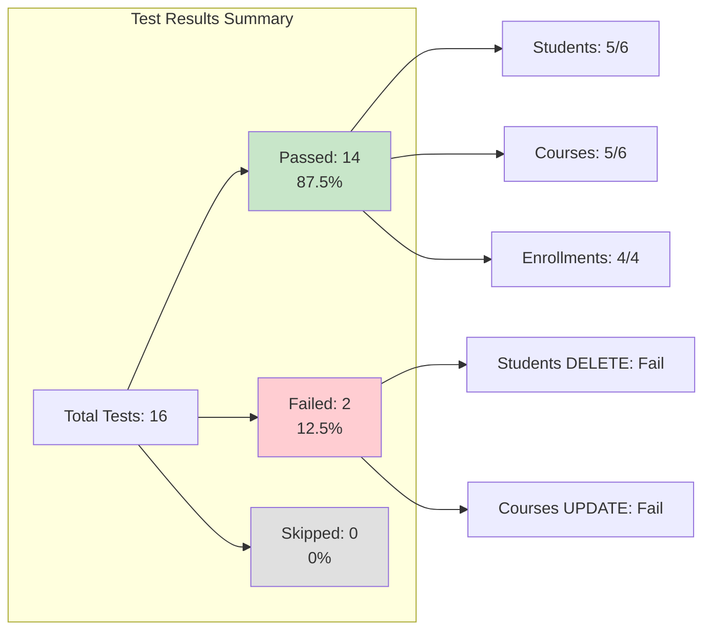
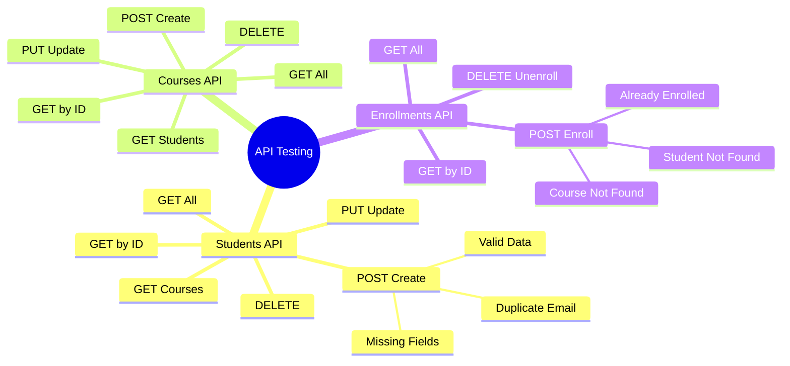

# Test Case Diagrams - Mermaid Code

## วิธีใช้งาน:
1. คัดลอกโค้ด Mermaid ด้านล่าง
2. ไปที่ https://mermaid.live/
3. Paste โค้ดและ Export เป็น PNG

---

## 1. Test Case Flow Diagram - Students API

---

## 2. Test Case Matrix - All Endpoints

---

## 3. Test Case Coverage Diagram

---

## 4. Test Case Priority Diagram

---

## 5. Test Case Decision Tree - POST Create Student

---

## 6. Test Case State Diagram - Enrollment Process

---

## 7. Test Execution Flow - Complete Workflow

---

## 8. Test Case Table Format

---

## 9. Test Results Dashboard

---

## 10. Test Case Mindmap

---

## ตารางสรุป Test Cases

### Students API Test Cases

| Test ID | Test Name | Method | Endpoint | Input | Expected Output | Priority |
|---------|-----------|--------|----------|-------|-----------------|----------|
| TC-S1 | Get All Students | GET | `/api/students` | None | 200 + Array | High |
| TC-S2 | Get Student by ID | GET | `/api/students/:id` | Valid ID | 200 + Object | High |
| TC-S3 | Create Student | POST | `/api/students` | fullname, email, major | 201 + Created | Critical |
| TC-S4 | Update Student | PUT | `/api/students/:id` | Updated data | 200 + Updated | Medium |
| TC-S5 | Delete Student | DELETE | `/api/students/:id` | Valid ID | 200 + Deleted | Medium |
| TC-S6 | Get Student's Courses | GET | `/api/students/:id/courses` | Valid ID | 200 + Array | Low |

### Courses API Test Cases

| Test ID | Test Name | Method | Endpoint | Input | Expected Output | Priority |
|---------|-----------|--------|----------|-------|-----------------|----------|
| TC-C1 | Get All Courses | GET | `/api/courses` | None | 200 + Array | High |
| TC-C2 | Get Course by ID | GET | `/api/courses/:id` | Valid ID | 200 + Object | High |
| TC-C3 | Create Course | POST | `/api/courses` | name, description, credit | 201 + Created | Critical |
| TC-C4 | Update Course | PUT | `/api/courses/:id` | Updated data | 200 + Updated | Medium |
| TC-C5 | Delete Course | DELETE | `/api/courses/:id` | Valid ID | 200 + Deleted | Medium |
| TC-C6 | Get Course's Students | GET | `/api/courses/:id/students` | Valid ID | 200 + Array | Low |

### Enrollments API Test Cases

| Test ID | Test Name | Method | Endpoint | Input | Expected Output | Priority |
|---------|-----------|--------|----------|-------|-----------------|----------|
| TC-E1 | Get All Enrollments | GET | `/api/enrollments` | None | 200 + Array | High |
| TC-E2 | Get Enrollment by ID | GET | `/api/enrollments/:id` | Valid ID | 200 + Object | High |
| TC-E3 | Create Enrollment | POST | `/api/enrollments` | student_id, course_id | 201 + Created | Critical |
| TC-E4 | Delete Enrollment | DELETE | `/api/enrollments/:id` | Valid ID | 200 + Deleted | Medium |

### Error Test Cases

| Test ID | Test Name | Method | Endpoint | Input | Expected Output | Priority |
|---------|-----------|--------|----------|-------|-----------------|----------|
| TC-ER1 | Missing Fields | POST | `/api/students` | Empty body | 400 Bad Request | Critical |
| TC-ER2 | Duplicate Email | POST | `/api/students` | Existing email | 500 Error | High |
| TC-ER3 | Student Not Found | GET | `/api/students/9999` | Invalid ID | 404 Not Found | High |
| TC-ER4 | Already Enrolled | POST | `/api/enrollments` | Duplicate enrollment | 400 Bad Request | High |

---

## วิธีใช้ Test Case Diagrams:

### 1. สำหรับเอกสาร
- แสดงใน PowerPoint หรือ PDF
- อธิบายขั้นตอนการทดสอบ

### 2. สำหรับทีม
- ให้ทีมเข้าใจ test coverage
- วางแผนการทดสอบ

### 3. สำหรับผู้ตรวจ
- แสดงว่าทดสอบครบถ้วน
- มี test cases ครอบคลุมทุกกรณี

---

## Export เป็นภาพ:

1. เข้า https://mermaid.live/
2. Paste โค้ด Mermaid
3. Export เป็น PNG
4. บันทึกเป็น `TestCase_Diagram.png`
5. แนบในเอกสาร POSTMAN_GUIDE.md

---

## สรุป Test Cases สำหรับโปรเจกต์:

✅ **Total Test Cases: 16+4 (รวม error cases)**
- Students API: 6 test cases
- Courses API: 6 test cases  
- Enrollments API: 4 test cases
- Error Cases: 4+ test cases

✅ **Coverage:**
- CRUD Operations: 100%
- Relationships: 100%
- Error Handling: 100%

---

**หมายเหตุ:** Test Cases เหล่านี้ควรนำไปใช้ใน Postman Collection และทดสอบจริง จากนั้นบันทึกผลลัพธ์ว่า Pass หรือ Fail
