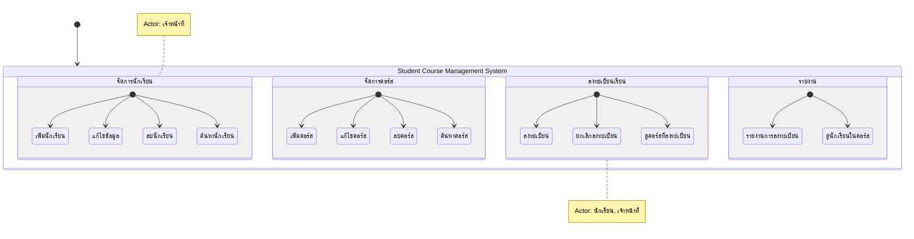
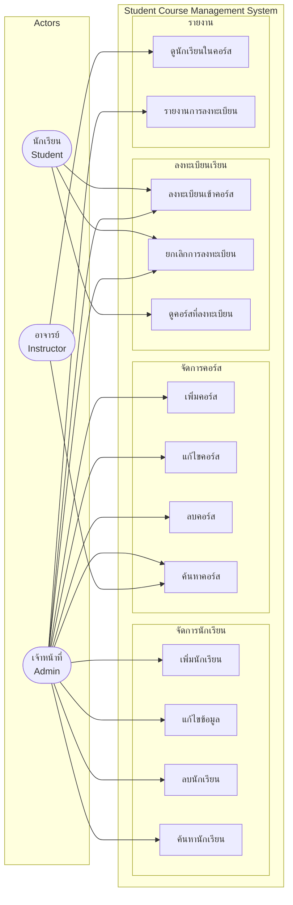
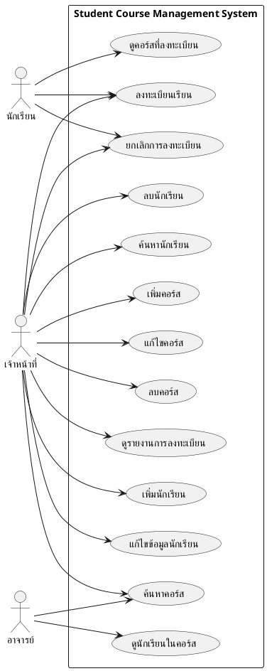

# Use Case Diagram - Mermaid Code

## วิธีใช้งาน:
1. คัดลอกโค้ด Mermaid ด้านล่าง
2. ไปที่ https://mermaid.live/
3. Paste โค้ดและ Export เป็น PNG

---

## Mermaid Code - Use Case Diagram

```mermaid
graph TB
    subgraph System["Student Course Management System"]
        UC1[เพิ่มนักเรียน]
        UC2[แก้ไขข้อมูลนักเรียน]
        UC3[ลบนักเรียน]
        UC4[ค้นหานักเรียน]
        UC5[เพิ่มคอร์ส]
        UC6[แก้ไขคอร์ส]
        UC7[ลบคอร์ส]
        UC8[ค้นหาคอร์ส]
        UC9[ลงทะเบียนเรียน]
        UC10[ยกเลิกการลงทะเบียน]
        UC11[ดูคอร์สที่ลงทะเบียน]
        UC12[ดูนักเรียนในคอร์ส]
        UC13[ดูรายงานการลงทะเบียน]
    end
    
    Student([นักเรียน])
    Admin([เจ้าหน้าที่])
    Instructor([อาจารย์])
    
    Student --> UC9
    Student --> UC10
    Student --> UC11
    
    Admin --> UC1
    Admin --> UC2
    Admin --> UC3
    Admin --> UC4
    Admin --> UC5
    Admin --> UC6
    Admin --> UC7
    Admin --> UC8
    Admin --> UC9
    Admin --> UC10
    Admin --> UC13
    
    Instructor --> UC8
    Instructor --> UC12
    
    style System fill:#f0f0f0,stroke:#333,stroke-width:2px
    style Student fill:#lightblue
    style Admin fill:#lightgreen
    style Instructor fill:#lightyellow
```



---

## Mermaid Code - Use Case (แบบ State Diagram)



---

## Mermaid Code - Actor & Use Case (แบบ Flowchart)



---

## สรุป Use Cases ตาม Actor:

### 👨‍🎓 นักเรียน (Student)
- ลงทะเบียนเข้าคอร์ส
- ยกเลิกการลงทะเบียน
- ดูคอร์สที่ลงทะเบียนไว้

### 👨‍💼 เจ้าหน้าที่ (Admin)
- จัดการนักเรียน (CRUD)
  - เพิ่มนักเรียน
  - แก้ไขข้อมูลนักเรียน
  - ลบนักเรียน
  - ค้นหานักเรียน
- จัดการคอร์ส (CRUD)
  - เพิ่มคอร์ส
  - แก้ไขคอร์ส
  - ลบคอร์ส
  - ค้นหาคอร์ส
- จัดการการลงทะเบียน
  - ลงทะเบียนนักเรียน
  - ยกเลิกการลงทะเบียน
- ดูรายงานการลงทะเบียนทั้งหมด

### 👨‍🏫 อาจารย์ (Instructor)
- ค้นหาคอร์ส
- ดูรายชื่อนักเรียนในคอร์ส

---

## สำหรับ Draw.io:

### ขั้นตอนสร้างด้วยมือ:

1. **สร้าง Actors (Stick Figures)**
   - นักเรียน
   - เจ้าหน้าที่
   - อาจารย์

2. **สร้าง System Boundary (กรอบสี่เหลี่ยมใหญ่)**
   - ชื่อ: "Student Course Management System"

3. **สร้าง Use Cases (วงรี) ภายในกรอบ:**
   - เพิ่มนักเรียน
   - แก้ไขข้อมูลนักเรียน
   - ลบนักเรียน
   - ค้นหานักเรียน
   - เพิ่มคอร์ส
   - แก้ไขคอร์ส
   - ลบคอร์ส
   - ค้นหาคอร์ส
   - ลงทะเบียนเรียน
   - ยกเลิกการลงทะเบียน
   - ดูคอร์สที่ลงทะเบียน
   - ดูนักเรียนในคอร์ส
   - ดูรายงานการลงทะเบียน

4. **ลากเส้นเชื่อม Actors กับ Use Cases:**
   - นักเรียน → Use Cases ที่เกี่ยวข้อง (3 อัน)
   - เจ้าหน้าที่ → Use Cases ที่เกี่ยวข้อง (ส่วนใหญ่)
   - อาจารย์ → Use Cases ที่เกี่ยวข้อง (2 อัน)

5. **จัดกลุ่ม Use Cases (Optional):**
   - กลุ่ม "จัดการนักเรียน"
   - กลุ่ม "จัดการคอร์ส"
   - กลุ่ม "ลงทะเบียน"
   - กลุ่ม "รายงาน"

6. **Export เป็น PNG**

---

## ตัวอย่างรูปแบบใน Draw.io:

```
┌────────────────────────────────────────────────────────────┐
│     Student Course Management System                       │
│                                                            │
│  ┌────────────┐    ┌────────────┐    ┌────────────┐      │
│  │  เพิ่ม      │    │  เพิ่ม      │    │ลงทะเบียน   │      │
│  │ นักเรียน    │    │  คอร์ส      │    │  เรียน      │      │
│  └────────────┘    └────────────┘    └────────────┘      │
│                                                            │
│  ┌────────────┐    ┌────────────┐    ┌────────────┐      │
│  │  แก้ไข     │    │  แก้ไข     │    │ยกเลิก      │      │
│  │  ข้อมูล     │    │  คอร์ส      │    │ลงทะเบียน   │      │
│  └────────────┘    └────────────┘    └────────────┘      │
│                                                            │
│  ... และอื่นๆ                                              │
│                                                            │
└────────────────────────────────────────────────────────────┘
     ↑               ↑               ↑
     │               │               │
  ┌──┴──┐         ┌──┴──┐         ┌──┴──┐
  │👤   │         │👤   │         │👤   │
  │นัก  │         │เจ้า │         │อา  │
  │เรียน│         │หน้าที่│        │จารย์│
  └─────┘         └─────┘         └─────┘
```

---

## ทางเลือกอื่น: PlantUML

หากต้องการความละเอียดมากขึ้น สามารถใช้ PlantUML:



ใช้ได้ที่: https://www.plantuml.com/plantuml/
